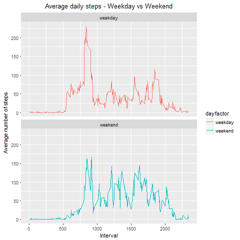

### Introduction
###### It is now possible to collect a large amount of data about personal movement using activity monitoring devices such as a Fitbit, Nike Fuelband, or Jawbone Up. These type of devices are part of the “quantified self” movement – a group of enthusiasts who take measurements about themselves regularly to improve their health, to find patterns in their behavior, or because they are tech geeks. But these data remain under-utilized both because the raw data are hard to obtain and there is a lack of statistical methods and software for processing and interpreting the data.

###### This assignment makes use of data from a personal activity monitoring device. This device collects data at 5 minute intervals through out the day. The data consists of two months of data from an anonymous individual collected during the months of October and November, 2012 and include the number of steps taken in 5 minute intervals each day.


### Loading and preprocessing the data

```r
amdf <- read.csv("activity.CSV", stringsAsFactors = FALSE)
amdf$date <- as.Date(amdf$date)
```

### What is mean total number of steps taken per day?
###### 1. Calculate the total number of steps taken per day

```r
library(dplyr)
amdf1 <- amdf %>%
    group_by(date) %>% 
    summarize(totalsteps=sum(steps, na.rm = TRUE))
```

###### 2. Make a histogram of the total number of steps taken each day
```r
hist(amdf1$totalsteps, main = "Total number of steps taken each day", xlab = "Total steps taken per day", col = "blue", breaks = seq(0,25000, by=2500))
```

<!-- -->

###### 3. Calculate and report the mean and median of the total number of steps taken per day
```r
mean(amdf1$totalsteps)
median(amdf1$totalsteps)
```
- **mean = 9354.23**
- **median = 10395**

### What is the average daily activity pattern?
###### 1. Make a time series plot (i.e. ) of the 5-minute interval (x-axis) and the average number of steps taken, averaged across all days (y-axis)
```r
amdf2 <- amdf %>%
    group_by(interval) %>%
    summarise(avgsteps = mean(steps, na.rm = TRUE))
plot(amdf2, type="l", main = "Average number of steps taken per interval", xlab = "Interval", ylab = "Average number of steps", col = "red")
```
<!-- -->

###### 2. Which 5-minute interval, on average across all the days in the dataset, contains the maximum number of steps?
```r
amdf2[which.max(amdf2$avgsteps), ]$interval
```
Interval **835** has the maximum steps across all days

###     Imputing missing values
###### 1. Calculate and report the total number of missing values in the dataset (i.e. the total number of rows with NAs)
```r
sum(is.na(amdf$steps))
```
There are **2304** rows with NAs.

###### 2. Devise a strategy for filling in all of the missing values in the dataset. The strategy does not need to be sophisticated. For example, one could use the mean/median for that day, or the mean for that 5-minute interval, etc. Here we are going to impute NA in steps column with the mean of steps in that particular interval across all 61 days.

```r
step_values_to_impute <- amdf2$avgsteps[match(amdf$interval, amdf2$interval)]
```

###### 3. Create a new dataset that is equal to the original dataset but with the missing data filled in.

```r
#Copy data over to a new data frame
imputed.amdf <- amdf
#Impute steps variable where it has NA values
imputed.amdf <- transform(amdf, steps = ifelse(is.na(amdf$steps), yes = step_values_to_impute, no = amdf$steps))
#Aggregate number of steps per day
total_steps_by_date <- aggregate(steps ~ date, imputed.amdf, sum)
names(total_steps_by_date) <- c("date", "steps")
```

###### 4. Make a histogram of the total number of steps taken each day and Calculate and report the mean and median total number of steps taken per day. Do these values differ from the estimates from the first part of the assignment? What is the impact of imputing missing data on the estimates of the total daily number of steps?

```r

hist(total_steps_by_date$steps, breaks = seq(0,25000, by=2500), main = "Total number of steps taken each day", xlab = "Total Steps per day", col = "green")

mean(total_steps_by_date$steps)
median(total_steps_by_date$steps)
```
- **mean = 10766.19**
- **median = 10766.19**

<!-- -->

###### As a result of imputation the mean and median total number of steps per day has increased.

### Are there differences in activity patterns between weekdays and weekends?

###### 1. Create a new factor variable in the dataset with two levels ? ?weekday? and ?weekend? indicating whether a given date is a weekday or weekend day.
```r
imputed.amdf$dayfactor  <- as.factor(ifelse(weekdays(imputed.amdf$date) %in% c("Saturday", "Sunday"), "weekend", "weekday"))

 
amdf3  <- imputed.amdf %>% 
    group_by(dayfactor, interval) %>% 
    summarise(avgsteps = mean(steps))
```

###### 2. Make a panel plot containing a time series plot (i.e type = "l") of the 5-minute interval (x-axis) and the average number of steps taken, averaged across all weekday days or weekend days (y-axis). See the README file in the GitHub repository to see an example of what this plot should look like using simulated data.

```r
library(ggplot2)
plot <- ggplot(amdf3, aes(x = interval , y = avgsteps, color = dayfactor)) +
    geom_line() +
    labs(title = "Average daily steps - Weekday vs Weekend", x = "Interval", y = "Average number of steps") + theme(plot.title = element_text(hjust = 0.5)) +
    facet_wrap(~dayfactor, ncol = 1, nrow=2)
plot
```
<!-- -->


